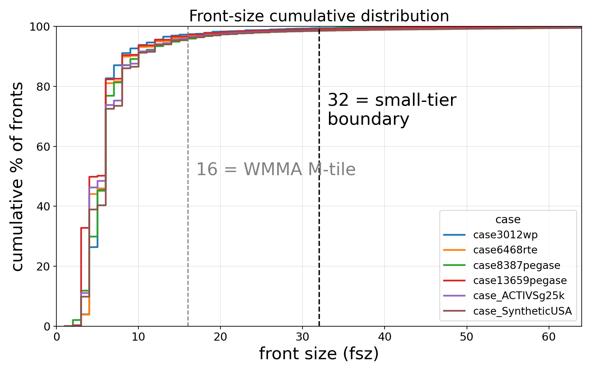
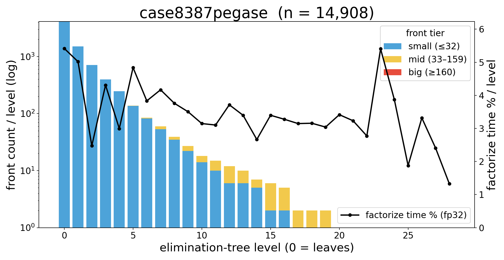
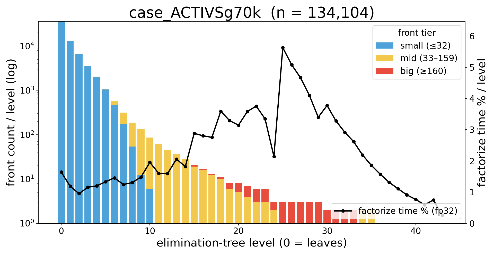
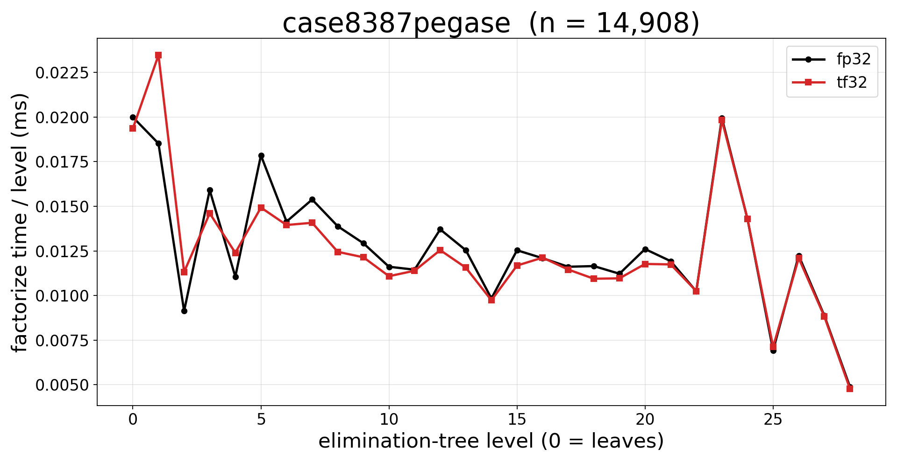
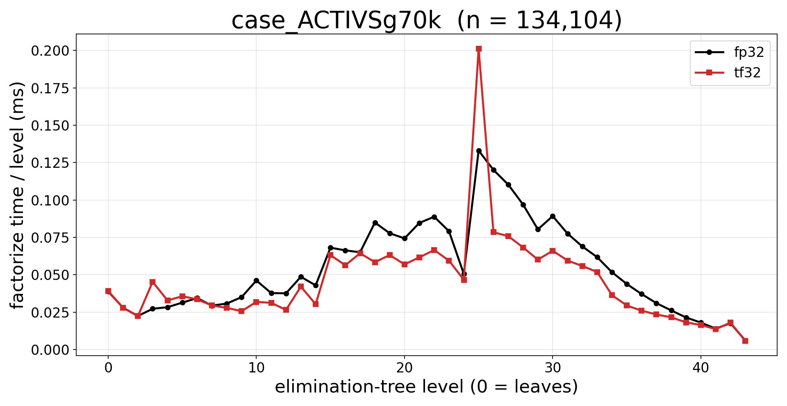

# 우리 문제의 elimination-tree 특성

> **상태**: reference   **갱신**: 2026-06-11
> **한 줄**: NR 파워플로 Jacobian 의 소거트리는 front 의 ~99%가 fsz≤32(작은 잎)이지만, factorize *시간*은 상위 레벨의 소수 large front 가 지배한다 — "개수는 작은 게 많고, 시간은 큰 게 먹는다".

데이터: 현재 빌드 + serial-ND seed 1588(전 측정 일치). front 덤프 `data/fronts_<case>.csv`(`--dump-fronts`), 레벨별 시간 `data/level_factor_time_<case>.csv`(아래 §3 계측).

---

## 1. Front-size 분포 — front 의 ~99%가 fsz≤32

| case | fronts | fsz 중앙값 | fsz p90 | fsz 최대 | **fsz≤16** | **fsz≤32** | nc 최대 | uc 최대 |
|---|---:|---:|---:|---:|---:|---:|---:|---:|
| 3xxx | 2,780 | 6 | 8 | 50 | 97.4% | **99.5%** | 8 | 42 |
| 6xxx | 5,902 | 6 | 9 | 65 | 97.0% | **99.1%** | 8 | 57 |
| 8xxx | 7,406 | 6 | 10 | 76 | 95.9% | **99.2%** | 8 | 68 |
| 13K | 12,388 | 5 | 8 | 90 | 97.3% | **99.1%** | 16 | 74 |
| 25K | 22,724 | 6 | 10 | 137 | 96.5% | **98.6%** | 16 | 121 |
| usa | 74,231 | 6 | 10 | 250 | 96.3% | **98.6%** | 16 | 234 |

**front 의 중앙값 fsz=6, ~96%가 fsz≤16, ~99%가 fsz≤32.** 큰 front(최대 수백)는 존재하지만 개수로는 1~2%뿐이다. 이건 NR Jacobian sparsity 가 만드는 본질적 분포 — 소거트리 잎이 대부분 차수 2~3 노드라 front 가 극소다. (이 "작은 front 가 너무 많다"가 텐서코어 가속을 막는 근원 → [`small-tier-no-tensorcore.md`](small-tier-no-tensorcore.md).)

---

## 2. 레벨마다 front tier 분포 (8387, 70K)

소거트리를 레벨(0=잎)로 끊어 본 front tier 구성. 잎에는 작은 front 가 수천 개, 위로 갈수록 개수는 급감하고 크기는 커진다.

| 8387 | 70K |
|---|---|
|  |  |
| (위 그림의 막대) | |

- **level 0 (잎)**: small front 가 8387 ~4,100개 / 70K ~35,000개 — 거의 전부 fsz≤32.
- **중간 레벨**: small→mid(노랑, 33–159)→big(빨강, ≥160)로 tier 가 이동. front 개수는 로그축으로 급감(레벨당 수천→수십→한 자리).
- **상위 레벨**: big front 1~3개씩(소거트리 root 부근의 separator). 70K 는 44 레벨, 8387 은 29 레벨.

표(레벨별 #fronts·tier·max_fsz, work%=Σuc²·nc 비중, factor time%=§3 fp32 측정):

**8387** (29 levels):

| level | #fronts | small | mid | big | max_fsz | work%(=Σuc²·nc) | **factor time%** |
|---:|---:|---:|---:|---:|---:|---:|---:|
| 0–0 (잎+하위) | 4102 | 4102 | 0 | 0 | 18 | 6.8% | 5.4% |
| 1 | 1513 | 1512 | 1 | 0 | 45 | 5.2% | **5.0%** |
| 2 | 708 | 707 | 1 | 0 | 33 | 3.6% | **2.5%** |
| 3 | 399 | 398 | 1 | 0 | 55 | 4.9% | **4.3%** |
| 4 | 247 | 246 | 1 | 0 | 59 | 4.5% | **3.0%** |
| 5 | 138 | 136 | 2 | 0 | 76 | 7.5% | **4.8%** |
| 6 | 85 | 82 | 3 | 0 | 70 | 7.6% | **3.8%** |
| 7 | 60 | 53 | 7 | 0 | 76 | 10.5% | **4.2%** |
| 8 | 39 | 35 | 4 | 0 | 68 | 7.8% | **3.8%** |
| 9 | 27 | 22 | 5 | 0 | 60 | 6.2% | **3.5%** |
| 10 | 18 | 14 | 4 | 0 | 52 | 5.2% | **3.1%** |
| 11 | 15 | 10 | 5 | 0 | 45 | 4.4% | **3.1%** |
| 12 | 12 | 6 | 6 | 0 | 67 | 5.4% | **3.7%** |
| 13 | 10 | 6 | 4 | 0 | 59 | 4.4% | **3.4%** |
| 14 | 7 | 5 | 2 | 0 | 51 | 1.7% | **2.7%** |
| 15 | 6 | 2 | 4 | 0 | 56 | 3.5% | **3.4%** |
| 16 | 5 | 2 | 3 | 0 | 48 | 2.5% | **3.3%** |
| 17 | 2 | 0 | 2 | 0 | 49 | 1.8% | **3.1%** |
| 18 | 2 | 0 | 2 | 0 | 53 | 1.7% | **3.2%** |
| 19 | 2 | 1 | 1 | 0 | 45 | 1.1% | **3.0%** |
| 20 | 1 | 0 | 1 | 0 | 56 | 1.4% | **3.4%** |
| 21 | 1 | 0 | 1 | 0 | 48 | 1.0% | **3.2%** |
| 22 | 1 | 0 | 1 | 0 | 40 | 0.6% | **2.8%** |
| 23 | 1 | 1 | 0 | 0 | 32 | 0.4% | **5.4%** |
| 24 | 1 | 1 | 0 | 0 | 24 | 0.2% | **3.9%** |
| 25 | 1 | 1 | 0 | 0 | 16 | 0.0% | **1.9%** |
| 26 | 1 | 1 | 0 | 0 | 18 | 0.1% | **3.3%** |
| 27 | 1 | 1 | 0 | 0 | 10 | 0.0% | **2.4%** |
| 28 | 1 | 1 | 0 | 0 | 2 | 0.0% | **1.3%** |

요약(레벨별 dominant tier 로 그 레벨 factor time% 귀속; 동률은 작은 tier):

| tier | 귀속된 levels | **factor time 비중** |
|---|---|---:|
| small | 0–14, 19, 23–28 | **77.6%** |
| mid | 15–18, 20–22 | **22.4%** |
| big | 없음 | **0.0%** |

**70K** (44 levels):

| level | #fronts | small | mid | big | max_fsz | work%(=Σuc²·nc) | **factor time%** |
|---:|---:|---:|---:|---:|---:|---:|---:|
| 0–12 (잎+하위) | 63639 | 62925 | 714 | 0 | 127 | 37.6% | 18.1% |
| 13 | 36 | 0 | 36 | 0 | 142 | 5.7% | **2.1%** |
| 14 | 28 | 1 | 27 | 0 | 131 | 4.3% | **1.8%** |
| 15 | 21 | 0 | 19 | 2 | 173 | 3.8% | **2.9%** |
| 16 | 17 | 0 | 16 | 1 | 174 | 4.7% | **2.8%** |
| 17 | 13 | 0 | 12 | 1 | 167 | 4.1% | **2.8%** |
| 18 | 11 | 0 | 10 | 1 | 208 | 3.1% | **3.6%** |
| 19 | 8 | 0 | 6 | 2 | 194 | 3.2% | **3.3%** |
| 20 | 8 | 0 | 5 | 3 | 188 | 3.6% | **3.1%** |
| 21 | 7 | 0 | 4 | 3 | 208 | 2.9% | **3.6%** |
| 22 | 6 | 0 | 3 | 3 | 216 | 3.3% | **3.8%** |
| 23 | 6 | 0 | 3 | 3 | 200 | 3.1% | **3.3%** |
| 24 | 3 | 0 | 2 | 1 | 184 | 0.7% | **2.1%** |
| 25 | 3 | 0 | 1 | 2 | 277 | 2.9% | **5.6%** |
| 26 | 3 | 0 | 0 | 3 | 261 | 3.4% | **5.1%** |
| 27 | 3 | 0 | 0 | 3 | 245 | 2.9% | **4.7%** |
| 28 | 3 | 0 | 1 | 2 | 229 | 2.4% | **4.1%** |
| 29 | 3 | 0 | 1 | 2 | 213 | 1.9% | **3.4%** |
| 30 | 2 | 0 | 1 | 1 | 213 | 1.1% | **3.8%** |
| 31 | 2 | 0 | 1 | 1 | 197 | 1.4% | **3.3%** |
| 32 | 2 | 0 | 1 | 1 | 181 | 1.2% | **2.9%** |
| 33 | 2 | 0 | 1 | 1 | 165 | 0.9% | **2.6%** |
| 34 | 2 | 0 | 2 | 0 | 149 | 0.7% | **2.2%** |
| 35 | 2 | 0 | 2 | 0 | 133 | 0.4% | **1.9%** |
| 36 | 1 | 0 | 1 | 0 | 117 | 0.3% | **1.6%** |
| 37 | 1 | 0 | 1 | 0 | 101 | 0.2% | **1.3%** |
| 38 | 1 | 0 | 1 | 0 | 85 | 0.1% | **1.1%** |
| 39 | 1 | 0 | 1 | 0 | 69 | 0.1% | **0.9%** |
| 40 | 1 | 0 | 1 | 0 | 53 | 0.0% | **0.8%** |
| 41 | 1 | 0 | 1 | 0 | 37 | 0.0% | **0.6%** |
| 42 | 1 | 1 | 0 | 0 | 21 | 0.0% | **0.7%** |
| 43 | 1 | 1 | 0 | 0 | 5 | 0.0% | **0.3%** |

요약(레벨별 dominant tier 로 그 레벨 factor time% 귀속; 동률은 작은 tier):

| tier | 귀속된 levels | **factor time 비중** |
|---|---|---:|
| small | 0–7, 42–43 | **11.2%** |
| mid | 8–24, 30–41 | **66.0%** |
| big | 25–29 | **22.9%** |

즉 트리는 **넓은 잎(작은 front 다수) + 좁은 위(큰 front 소수)** 의 전형적 멀티프론탈 구조다.

---

## 3. 레벨마다 전체 factorize 에서 차지하는 시간 (측정)

소스에 `EXP_260611_LEVEL_TIME` 게이트 계측을 추가해 측정했다(아래 방법). 그림 우축의 검은 선 = 레벨별 factorize 시간 비중(%), fp32. 레벨별 수치는 §2 표의 `factor time%` 열. 총시간: 8387 0.369ms, 70K 2.365ms.

레벨별 factorize 시간 절대값(ms), fp32(검정) vs tf32:

| 8387 | 70K |
|---|---|
|  |  |

### 측정 방법 (EXP_260611)
- 추가 소스(전부 `#ifdef EXP_260611_LEVEL_TIME` 게이트): `factorize/schedule.cuh`(`exp_260611_level_times_pass` — 단일스트림 레벨 워크에서 레벨마다 `cudaEventRecord`), `factorize/factorize.{hpp,cu}`(`factorize_exp_260611_level_time` — repeat 마다 re-scatter 후 레벨 패스, level L 시간 = `elapsed(ev[L],ev[L+1])`), `solver.{hpp,cpp}`, `tests/run_custom_solver.cu`(`--exp-level-time N`).
- 빌드: `-DCMAKE_CUDA_FLAGS=-DEXP_260611_LEVEL_TIME -DCMAKE_CXX_FLAGS=-DEXP_260611_LEVEL_TIME`. 실행: `custom_linear_solver_run <case-dir> --exp-level-time 21 --precision fp32 --serial-nd --metis-seed 1588`.
- **단일스트림** per-level attribution (production 멀티스트림은 독립 subtree 를 겹쳐 wall 이 더 짧지만, 레벨별 상대 비중은 대표적). **pre-TC 병목 분석이라 fp32** 측정(big front 전부 scalar), 21 repeats 평균.

---
