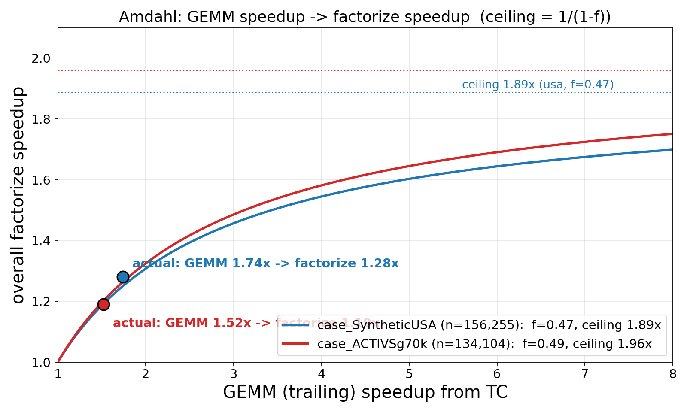

# 왜 small tier 는 텐서코어로 가속할 수 없는가

> **상태**: reference   **갱신**: 2026-06-11
> **한 줄**: 전력망 Jacobian 의 front 99%가 fsz≤32(small tier)이고, 그 trailing GEMM 이 텐서코어 최소 타일보다 훨씬 작아 대부분이 zero-padding 이라 TC 가속이 불가능함을 데이터·FLOP·HW 형식으로 보인다.

텐서코어 가속(TF32 Ozaki trailing GEMM)은 **mid/large tier(fsz>32)** 에만 적용된다. small tier(fsz≤32)는 warp-packed scalar 커널로 돈다. 이 문서는 그 이유를 4단계로 설명한다.

---

## 1. 전제 — front 의 ~99%가 small tier (fsz≤32)

NR Jacobian front 의 중앙값 fsz=6, ~96%가 fsz≤16, **~99%가 fsz≤32**(small tier). 분포·CDF·통계표·레벨별 구조는 별도 문서 [`etree-characteristics.md`](etree-characteristics.md) §1–2 참조. 이 문서는 "그 small front 들을 왜 텐서코어로 못 돌리는가"를 GEMM 모양·FLOP·HW 형식으로 설명한다.

---

## 2. tier 별 trailing GEMM shape (small / mid / big)

멀티프론탈에서 front(크기 `fsz`)는 `nc` 피벗 열 + `uc = fsz − nc` contribution 행/열로 나뉜다. 인수분해 후 trailing(Schur) 업데이트는

```
S(uc × uc)  −=  L(uc × nc) · U(nc × uc)        →  GEMM  M = N = uc,  K = nc
```

tier 별 실측 shape (전 6+1 케이스 front 집계, mid/big 경계 = float shared 한도 `kFloatSharedFrontMax = 159`):

| tier | fsz | front 비중 | nc(K) 중앙/최대 | uc(M=N) 중앙/p90/최대 | GEMM (중앙) | GEMM (최대) |
|---|---|---:|---|---|---|---|
| **small** | ≤32 | **98.7%** | 2 / 16 | 4 / 8 / 30 | **4 × 4 × 2** | 30 × 30 × 16 |
| **mid** | 33–159 | 1.3% | 14 / 16 | 40 / 83 / 151 | **40 × 40 × 14** | 151 × 151 × 16 |
| **big** | ≥160 | 0.04% | 16 / 16 | 175 / 212 / 261 | **175 × 175 × 16** | 261 × 261 × 16 |

→ small 을 지배하는 건 **M=N≈4, K≈2** 의 극소 GEMM(특히 K=nc 중앙값 2). mid/big 은 M=N 수십~수백.

---

## 3. tier 별 FLOPs 와 텐서코어 타일 충족

trailing GEMM 연산량 = `2 · uc² · nc` (MAC 2 FLOP). 텐서코어 타일은 Ampere TF32 `16 × 8 × 8`(=1,024 MAC, §4). 중앙 GEMM 이 그 타일을 얼마나 채우는지:

| tier | front 비중 | front당 FLOPs (중앙/최대) | **전체 trailing FLOP 비중** | 중앙 GEMM 의 TC 타일 충족 |
|---|---:|---|---:|---|
| **small** | 98.7% | 64 / 9,680 | **8.9%** | 4×4×2 → 타일 1개의 **3%** (97% padding) |
| **mid** | 1.3% | 32,856 / 654,368 | **63.0%** | 40×40×14 → **30 타일, 73%** 채움 |
| **big** | 0.04% | 957,728 / 2,179,872 | **28.1%** | 175×175×16 → **484 타일, 99%** 채움 |

**핵심 두 가지**:
1. **small 은 front 의 98.7%지만 trailing FLOP 의 8.9%뿐.** 개수만 많고 일감은 극소(front 당 64 FLOP 중앙값). mid+big(front 1.3%)이 **FLOP 의 91%**.
2. **small 의 GEMM(4×4×2)은 TC 타일 한 개의 3%만 채운다**(97% padding) → 텐서코어로 가속 불가. 반면 **mid(73%)·big(99%)은 타일을 꽉 채운다** → TC 가 효율적.

즉 텐서코어가 의미 있는 건 **타일을 채우면서 FLOP 의 91%를 가진 mid/big** 이고, small 은 (a) 타일을 못 채우고 (b) FLOP 비중도 작아 **warp-packed scalar**(한 warp 가 32 lane 으로 여러 작은 front 를 동시에 — front-간 병렬)가 옳다. small 의 front당 일감(수십 FLOP)은 MMA 명령의 fragment load/accumulator drain 같은 고정 오버헤드보다도 작다.

---

## 4. 텐서코어 지원 형식 (RTX 3090 = Ampere, 및 이후 세대) — 최소 타일이 front 보다 크다

텐서코어 MMA 는 **고정 크기 타일**만 처리한다. fsz<32 front 의 M·N·K 는 그 최소 타일보다 작아 **타일의 대부분이 zero-padding** 이 된다.

| 세대 (GPU) | 명령 | 대표/최소 MMA shape (M×N×K) | 비고 |
|---|---|---|---|
| **Ampere sm_86 (RTX 3090)** | PTX `mma.sync` | **16 × 8 × 8** (TF32), 16×8×16 (FP16) | M 최소 16, K 최소 8 |
| Ampere | WMMA | 16 × 16 × 8 (TF32), 16×16×16 (FP16) | M·N 최소 16 |
| **Hopper sm_90** | `wgmma` | **64 × N × 16** (N=8..256) | **M 고정 64** — 더 큼 |
| **Blackwell sm_100** | `tcgen05` | **최대 256 × 256 × 16**, FP4/FP6/FP8 | 타일 더 큼 |

**RTX 3090(Ampere) 기준**: 가장 작은 텐서코어 연산이 **16×8×8**(TF32 PTX). 지배적 small front(4×4×2)를 여기 태우면 채움률은

```
fill = (uc · uc · nc) / (16 · 8 · 8)
     = (4·4·2) / 1024 = 3.1%      → 96.9%가 padding (중앙값 front)
       (8·8·2) / 1024 = 12.5%     → 87.5% padding  (p90 front)
```

한 타일을 꽉 채우려면 **uc≥16 그리고 nc≥8**(대략 fsz≥22)이 필요한데, 그런 front 는 전체의 **1~2%뿐**이다(§1). 즉 front 의 ~98%는 텐서코어 타일을 못 채운다.

**이후 세대에서 더 나빠진다**: Hopper WGMMA 는 M 이 **64로 고정**, Blackwell tcgen05 는 **256×256** 까지 커진다. 최소 타일 granularity 가 세대마다 *증가*하므로, fsz=6 front 의 padding 비율은 신형 GPU 일수록 오히려 더 커진다. small-front 문제는 HW 세대가 올라가도 해소되지 않는다(악화된다).

---

## 5. 측정 — 티어별 factor 시간 비중과 TC 효과 (mid/big)

티어마다 다른 커널(`factor_small` / `factor_mid_blocked` / `factor_big`)이라 nsys 로 커널별 GPU 시간을 집계했다 (B=1, 단일스트림, EXP 직접-issue 경로로 graph 우회).

**(a) 티어별 factor 시간 비중 vs FLOP 비중** (tf32):

| case | | small | mid | big |
|---|---|---:|---:|---:|
| **70K** | **시간** | 5.5% | 28.1% | **66.5%** |
| | FLOP | 7.2% | 62.5% | 30.3% |
| **usa** | **시간** | 8.0% | 33.2% | **58.8%** |
| | FLOP | 8.2% | 60.4% | 31.4% |

- **big: FLOP 의 ~30% 인데 시간은 ~60%**(≈2× 과대) — front 당 1블록이라 GPU(82 SM)를 못 채워 비효율(root/separator 병목, [`etree-characteristics.md`](etree-characteristics.md) §3).
- **mid: FLOP 의 ~60% 인데 시간은 ~30%**(≈0.5×) — shared-resident 로 front 가 많아 효율적. small: 시간 ≈ FLOP.

**(b) TC 가 mid/big 을 얼마나 줄였나** — fp32(scalar trailing, no-TC) vs tf32(Ozaki TC), B=1. **둘을 구분**한다: ① factorize **커널 전체** 시간, ② 그 중 **trailing GEMM 만** (NT 분리: trailing 을 건너뛴 `EXP_260611_NO_TRAILING` 빌드의 커널시간을 빼서 GEMM = full − NT).

**① factorize 커널 전체** (ms) — trailing GEMM 외 panel-LU·U-solve·staging·extend-add(non-TC) 포함:

| case | tier | fp32 | tf32 | 커널 감소 / speedup |
|---|---|---:|---:|---|
| 70K | small | 1.464 | 1.466 | ~0% / 1.00× (TC 미적용 확인) |
| 70K | **mid** | 8.844 | 7.524 | 14.9% / **1.18×** |
| 70K | **big** | 21.519 | 17.807 | 17.2% / **1.21×** |
| usa | **mid** | 11.452 | 9.392 | 18.0% / **1.22×** |
| usa | **big** | 22.574 | 16.657 | 26.2% / **1.36×** |

**② trailing GEMM 단독** (ms, full − NT) — TC 가 실제로 가속하는 부분:

| case | tier | GEMM fp32(scalar) | GEMM tf32(TC) | **GEMM speedup** |
|---|---|---:|---:|---:|
| 70K | **mid** | 2.490 | 1.534 | **1.62×** |
| 70K | **big** | 12.974 | 8.619 | **1.51×** |
| usa | **mid** | 3.518 | 1.970 | **1.79×** |
| usa | **big** | 13.610 | 7.884 | **1.73×** |

- **TC 의 GEMM 가속은 mid 1.62–1.79×, big 1.51–1.73×.** front 클수록·usa 일수록 이득↑.
- **커널 전체로는 1.18–1.36× 로 희석**된다 — mid/big 커널의 ~40–60% 가 non-TC(panel-LU·U-solve·staging·extend). 특히 big 은 trailing GEMM 이 커널의 ~60%(70K fp32 12.97/21.52)라 GEMM 가속이 커널에 크게 반영된다.
- (NT 분리는 tf32/fp32 staging 경로 차로 ±변동 있음 — 대략값. small 은 애초에 TC 미적용이라 생략.)

**(c) Amdahl 검증 — 숫자 일관성과 상한**

위 측정이 전체 factorize 가속(단독 sweep 06 의 usa B=1 = **1.28×**)과 모순 없는지 Amdahl 로 확인:

| case | GEMM 이 factorize 에서 차지(f) | GEMM 가속(s) | Amdahl 예측 `1/((1−f)+f/s)` | 실측 전체 factorize |
|---|---:|---:|---:|---:|
| usa | **47%** (17.1/36.3 ms) | 1.74× | **1.25×** | **1.28×** (sweep 06 도 1.28×) |
| 70K | 49% (15.5/31.8 ms) | 1.52× | 1.20× | 1.19× |

예측 ≈ 실측 — **숫자 체인이 닫힌다**: GEMM 자체 1.5–1.8× 가속 × GEMM 은 factorize 의 ~절반 → 전체 ~1.2–1.28×.



**상한**: GEMM 을 아무리 가속해도(s→∞) 전체 factorize 는 **`1/(1−f)` 에서 멈춘다** — usa 는 **1.89×**, 70K 는 1.96×. 나머지 절반(panel-LU·U-solve·staging·extend, non-TC)이 천장을 만든다. 실제 GEMM 1.74× 는 그 곡선 위 **factorize 1.28×** 점. 즉 **factorize 를 더 가속하려면 GEMM(TC) 보다 non-GEMM(staging/extend/panel) 을 줄여야** 천장 자체가 올라간다.

**(d) GEMM 가속이 왜 1.5–1.8× 에 그치나 — ncu 진단 (TC starved)**

`factor_big<float, TF32>` (usa, 대표 launch) Nsight Compute:

| 메트릭 | 값 | 의미 |
|---|---:|---|
| **tensor-op active** | **2.38%** | 텐서코어 거의 안 씀 (포화의 ~1/40) |
| math_pipe_throttle (stall) | 0.45 | 연산 pipe 병목 **아님** |
| **warps_active** | **25.6%** | occupancy 낮음 |
| occupancy 제한 | **1 block/SM** | registers(89/thread) + shared-mem(L/U staging) |
| **stall: barrier** | **5.34** (최대) | `__syncthreads()` 대기 |
| stall: long scoreboard | 3.58 | 메모리(staging·fragment load) 대기 |

→ **TC 처리량 한계가 아니라 TC 를 못 먹여서**다:
- big front = **1 block/front → 1 block/SM**(register 89 + shared staging) → **warp 26% 만 활성**.
- 커널에 `__syncthreads()` 多(panel-LU→U-solve→블록 GEMM 매 K-block). SM 당 블록 1개라 **barrier 대기 중 돌릴 다른 warp 가 없어** SM 이 통째로 논다(barrier stall 5.34 지배). 메모리 latency(scoreboard 3.58)도 안 숨겨짐.
- 결과 **TF32 pipe 98% 유휴** → 1.5–1.8× 는 짧은 활성 구간의 per-MMA 밀도 이득일 뿐.

뿌리는 §5(a)의 "big = 1블록/front under-util" 과 같다. **GEMM 을 더 가속하려면 occupancy 를 올려야**(한 front 를 여러 블록으로 쪼개 barrier/latency 은닉) 하고, 이는 §5(c) 의 천장(non-GEMM)을 낮추는 것과 함께 가야 factorize 가 더 빨라진다.

---

## 결론

1. NR Jacobian front 의 **98.7%가 fsz≤32**(small), 중앙값 6 (§1).
2. tier 별 trailing GEMM: **small 4×4×2(64 FLOP) / mid 40×40×14 / big 175×175×16**. **small 이 front 98.7%지만 trailing FLOP 의 8.9%뿐, mid+big(front 1.3%)이 FLOP 의 91%** (§2–3).
3. Ampere TC 최소 타일 **16×8×8** 기준: small 4×4×2 는 타일의 **3%만** 채움(97% padding) → TC 불가. mid(73%)·big(99%)은 타일을 채움 → TC 효율적 (§3–4). Hopper(M=64)·Blackwell(256)은 small 에 더 불리.
4. 따라서 텐서코어는 **타일을 채우면서 FLOP 의 91%를 가진 mid/big** 에만 적용하고, **small(타일 미충족 + FLOP 8.9%)은 warp-packed scalar**(front-간 병렬)로 둔다.
5. **측정(§5)**: 티어별 factor 시간 비중 small ~6% / mid ~30% / big ~60%(big 은 1블록/front under-util 로 FLOP 30% 대비 시간 과대). TC 효과는 **trailing GEMM 단독으로 mid 1.62–1.79× / big 1.51–1.73×** (NT 분리), **factorize 커널 전체로는 1.18–1.36×** 로 희석(non-TC panel-LU·staging·extend 포함). small 은 TC 미적용(~0%).

> 연계: TC 가속의 실측 천장은 [`04-gemm-fraction-tc-ceiling.md`](../02-design-analysis/04-gemm-fraction-tc-ceiling.md), tier 임계값 근거는 [`05-tier-thresholds.md`](../02-design-analysis/05-tier-thresholds.md), mid trailing GEMM 의 TC-효율 재구조화는 [`../03-optimization-notes/`](../03-optimization-notes/).

### Sources (텐서코어 형식)
- [NVIDIA Tensor Core Evolution: From Volta to Blackwell — SemiAnalysis](https://newsletter.semianalysis.com/p/nvidia-tensor-core-evolution-from-volta-to-blackwell)
- [Why is there a 16x8x16 TensorOp for tf32 but not a 16x16x8? — NVIDIA/cutlass Discussion #1382](https://github.com/NVIDIA/cutlass/discussions/1382)
- [Hopper/Blackwell Tensor Core MMA layouts — vj-krish](https://vjkrish.com/2026/01/19/Mma_Layouts.html)
- [tcgen05 for dummies — gau-nernst](https://gau-nernst.github.io/tcgen05/)
