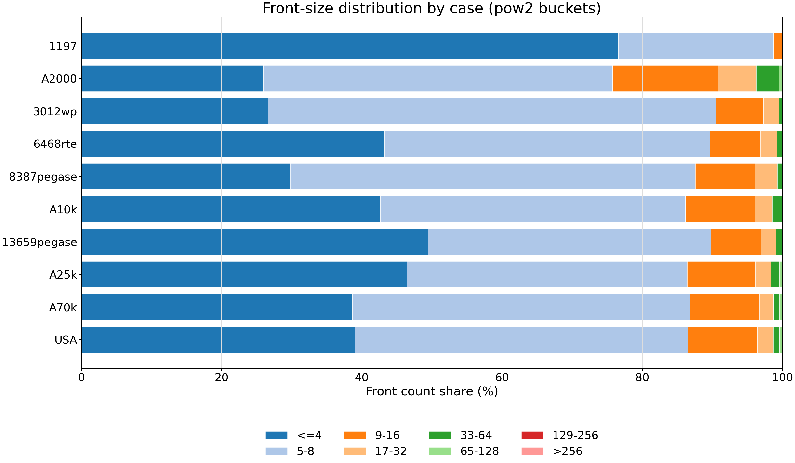
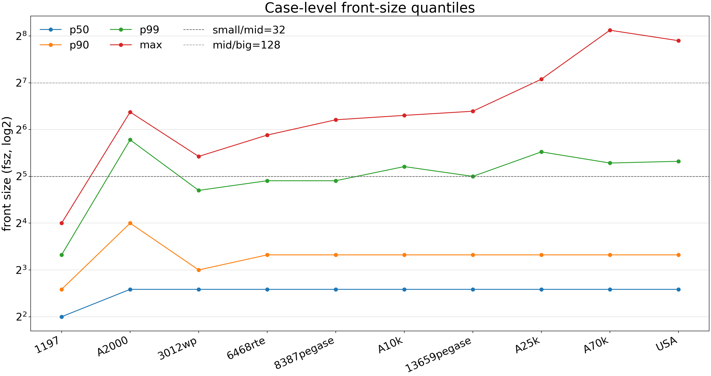
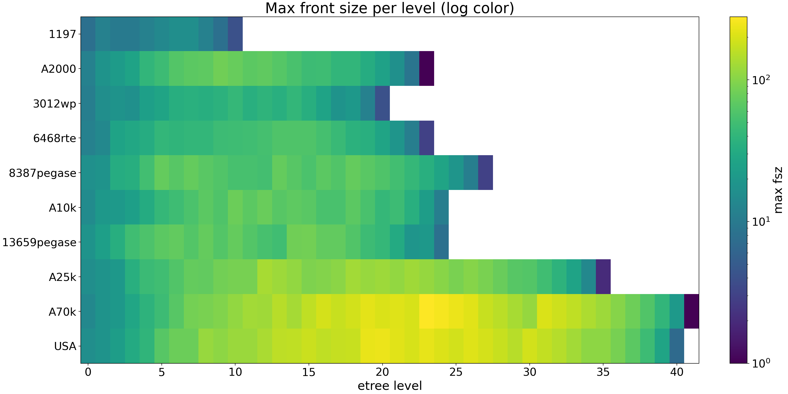

# Front-Size Plots

Generated by `scripts/plot_front_stats.py`.

The histogram buckets use powers of two so the small-front region is visible:
`<=4`, `5-8`, `9-16`, `17-32`, `33-64`, `65-128`, `129-256`, `>256`.

## Figures

### Case-Level Pow2 Histogram

### Case-Level Quantiles

### Level Max Heatmap

## Per-Case Level Plots

### Stacked Level Distributions

Each horizontal bar is one etree level. Level 0 is at the bottom. Bar segments show the front-size bucket mix within that level; numbers inside segments are front counts, and `n=...` at the right is the total front count for the level.

- `figures/by_case/case1197_level_front_distribution.png`
- `figures/by_case/case_ACTIVSg2000_level_front_distribution.png`
- `figures/by_case/case3012wp_level_front_distribution.png`
- `figures/by_case/case6468rte_level_front_distribution.png`
- `figures/by_case/case8387pegase_level_front_distribution.png`
- `figures/by_case/case_ACTIVSg10k_level_front_distribution.png`
- `figures/by_case/case13659pegase_level_front_distribution.png`
- `figures/by_case/case_ACTIVSg25k_level_front_distribution.png`
- `figures/by_case/case_ACTIVSg70k_level_front_distribution.png`
- `figures/by_case/case_SyntheticUSA_level_front_distribution.png`

### Quantiles And Level Counts

- `figures/by_case/case1197_level_front_stats.png`
- `figures/by_case/case_ACTIVSg2000_level_front_stats.png`
- `figures/by_case/case3012wp_level_front_stats.png`
- `figures/by_case/case6468rte_level_front_stats.png`
- `figures/by_case/case8387pegase_level_front_stats.png`
- `figures/by_case/case_ACTIVSg10k_level_front_stats.png`
- `figures/by_case/case13659pegase_level_front_stats.png`
- `figures/by_case/case_ACTIVSg25k_level_front_stats.png`
- `figures/by_case/case_ACTIVSg70k_level_front_stats.png`
- `figures/by_case/case_SyntheticUSA_level_front_stats.png`

## Data

- `data/front_size_pow2_histogram.csv`: source table for the pow2 bucket plot.
