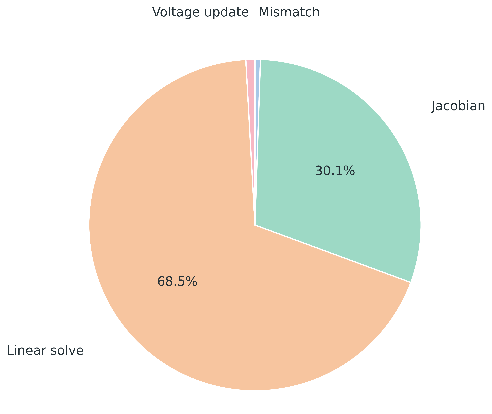
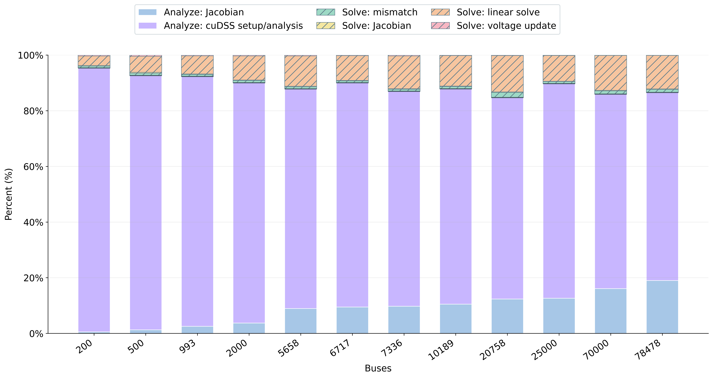

# KCC Selected Five-Case Results

- Accuracy is reported as max final mismatch across the measured repeats.
- The `Base_Eastern_Interconnect_515GW` end-to-end CUDA edge value uses the warmup 3 rerun.

## Selected Cases
| case | buses | Ybus nnz | PV buses | PQ buses |
| --- | --- | --- | --- | --- |
| case_ACTIVSg200 | 200 | 690 | 37 | 162 |
| MemphisCase2026_Mar7 | 993 | 3669 | 187 | 805 |
| Texas7k_20220923 | 6717 | 24009 | 589 | 6127 |
| Base_West_Interconnect_121GW | 20758 | 78550 | 766 | 19991 |
| Base_Eastern_Interconnect_515GW | 78478 | 294392 | 2038 | 76439 |

## End-To-End Speed And Accuracy
### Speed
- Time values are milliseconds; speedups are baseline / CUDA edge, so larger is faster.

| case | buses | PYPOWER ms | CPP naive ms | CPP optimized ms | CUDA edge ms | CUDA vs PYPOWER | CUDA vs CPP opt |
| --- | --- | --- | --- | --- | --- | --- | --- |
| case_ACTIVSg200 | 200 | 7.837 | 1.208 | 0.413 | 12.01 | 0.65x | 0.03x |
| MemphisCase2026_Mar7 | 993 | 15.83 | 6.731 | 3.143 | 15.39 | 1.03x | 0.20x |
| Texas7k_20220923 | 6717 | 118.1 | 83.37 | 36.32 | 62.88 | 1.88x | 0.58x |
| Base_West_Interconnect_121GW | 20758 | 491.6 | 406.0 | 158.7 | 98.85 | 4.97x | 1.61x |
| Base_Eastern_Interconnect_515GW | 78478 | 2652.1 | 2874.1 | 979.7 | 223.6 | 11.86x | 4.38x |

### Accuracy: Max Final Mismatch
| case | buses | PYPOWER | CPP naive | CPP optimized | CUDA edge |
| --- | --- | --- | --- | --- | --- |
| case_ACTIVSg200 | 200 | 2.524e-13 | 2.561e-13 | 2.561e-13 | 6.189e-12 |
| MemphisCase2026_Mar7 | 993 | 5.964e-12 | 5.977e-12 | 2.117e-12 | 7.256e-12 |
| Texas7k_20220923 | 6717 | 1.939e-12 | 4.108e-12 | 3.878e-12 | 1.714e-10 |
| Base_West_Interconnect_121GW | 20758 | 2.744e-11 | 4.026e-11 | 1.282e-10 | 8.048e-09 |
| Base_Eastern_Interconnect_515GW | 78478 | 2.309e-11 | 2.325e-11 | 3.364e-11 | 9.360e-09 |

## Edge Vs Vertex Jacobian Update
| case | buses | edge J ms | vertex J ms | edge speedup |
| --- | --- | --- | --- | --- |
| case_ACTIVSg200 | 200 | 0.026 | 0.023 | 0.88x |
| MemphisCase2026_Mar7 | 993 | 0.023 | 0.028 | 1.21x |
| Texas7k_20220923 | 6717 | 0.043 | 0.064 | 1.51x |
| Base_West_Interconnect_121GW | 20758 | 0.106 | 0.185 | 1.75x |
| Base_Eastern_Interconnect_515GW | 78478 | 0.462 | 0.802 | 1.74x |

## CUDA Edge Ablation
- Time values are elapsed milliseconds.

| case | buses | full ms | w/o cuDSS ms | w/o Jacobian ms | w/o mixed precision ms |
| --- | --- | --- | --- | --- | --- |
| case_ACTIVSg200 | 200 | 12.05 | 1.473 | 12.28 | 13.51 |
| MemphisCase2026_Mar7 | 993 | 15.31 | 6.797 | 21.23 | 15.83 |
| Texas7k_20220923 | 6717 | 29.19 | 81.43 | 44.19 | 33.97 |
| Base_West_Interconnect_121GW | 20758 | 73.35 | 525.9 | 148.3 | 75.79 |
| Base_Eastern_Interconnect_515GW | 78478 | 228.1 | 2736.8 | 602.1 | 248.6 |

## Figures
- Base Florida PYPOWER operator pie: `figures/base_florida_pypower_newtonpf_pie.png`
- CUDA edge analyze/solve stack by bus count: `figures/cuda_edge_analyze_solve_stack_by_bus.png`
- The pie chart uses PYPOWER `newtonpf` operator timing and excludes `init_index`.
- The stacked graph uses combined analyze+solve percentages on the y-axis; solve components use hatching and a separator line marks the analyze/solve boundary.

